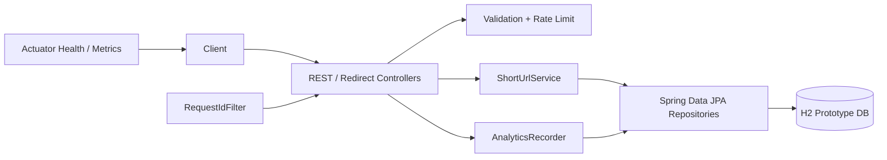

# AI-Assisted URL Shortener

A production-minded Spring Boot prototype created for the **AI-Proficient Software Engineer** interview assignment. The service converts long HTTP/HTTPS URLs into short aliases, redirects users, records privacy-conscious click analytics, and demonstrates engineer-led AI-assisted execution with explicit validation, risk controls, and documentation.

## What is implemented

- Create a short URL with a generated Base62 code or optional custom alias.
- Redirect `/{code}` using HTTP `302 Found`.
- Retrieve URL metadata and lifetime click count.
- Retrieve analytics for an optional time range, including daily click totals.
- Deactivate a short URL; subsequent redirects return `410 Gone`.
- URL, alias, expiration, and request validation.
- Secure random code generation plus database uniqueness and collision retries.
- Request correlation through `X-Request-Id`.
- Best-effort click analytics so a non-critical analytics failure does not intentionally become part of redirect business logic.
- Privacy-conscious analytics: client address is SHA-256 hashed instead of stored raw.
- Simple per-instance creation rate limiting.
- H2 file persistence for a zero-dependency local demo.
- Spring Boot Actuator health and metrics endpoints.
- Unit/service/integration tests.
- GitHub Actions CI workflow.
- Dockerfile, Postman collection, and local demo scripts.

## Technology choices

- Java 21
- Spring Boot 4.1.0
- Spring MVC
- Spring Data JPA / Hibernate
- H2 for local prototype persistence
- Bean Validation
- Spring Boot Actuator
- JUnit / AssertJ / Mockito / MockMvc
- Maven

Spring Boot 4.1.0 is intentionally used as the current stable Spring Boot release at the time of this submission. Java 21 gives a current LTS runtime while keeping the code conventional and easy to review.

## Architecture



More detail: [docs/ARCHITECTURE.md](docs/ARCHITECTURE.md)

## API summary

| Method | Endpoint | Purpose |
|---|---|---|
| `POST` | `/api/v1/urls` | Create a short URL |
| `GET` | `/{code}` | Redirect to the original URL |
| `GET` | `/api/v1/urls/{code}` | Get metadata |
| `GET` | `/api/v1/urls/{code}/analytics` | Get click analytics |
| `DELETE` | `/api/v1/urls/{code}` | Deactivate a short URL |
| `GET` | `/actuator/health` | Health check |

Full examples: [docs/API.md](docs/API.md)

## Run locally

### Prerequisites

- JDK 21
- Maven 3.9+

Confirm:

```bash
java -version
mvn -version
```

### Start the application

```bash
mvn clean spring-boot:run
```

The application starts on:

```text
http://localhost:8080
```

H2 data is persisted under `./data/` so links remain after a restart. To reset the local database, stop the app and delete the `data/` directory.

### Run tests

```bash
mvn clean verify
```

### Build executable JAR

```bash
mvn clean package
java -jar target/ai-assisted-url-shortener-1.0.0.jar
```

## Fast demo

### Windows PowerShell

With the app running in one terminal:

```powershell
.\scripts\demo.ps1
```

### macOS/Linux

```bash
./scripts/demo.sh
```

For screenshots, use the sequence in [docs/SCREENSHOT_GUIDE.md](docs/SCREENSHOT_GUIDE.md).

## Example create request

```bash
curl -X POST http://localhost:8080/api/v1/urls \
  -H "Content-Type: application/json" \
  -d '{"url":"https://example.com/docs","customAlias":"vendor-demo"}'
```

Example response:

```json
{
  "code": "vendor-demo",
  "shortUrl": "http://localhost:8080/vendor-demo",
  "originalUrl": "https://example.com/docs",
  "createdAt": "2026-08-20T14:00:00Z",
  "expiresAt": "2026-09-19T14:00:00Z",
  "active": true,
  "customAlias": true,
  "totalClicks": 0
}
```

Timestamps will differ when you run it.

## Configuration

Main settings are in `src/main/resources/application.yml`.

| Setting | Default | Purpose |
|---|---:|---|
| `BASE_URL` | `http://localhost:8080` | Public base URL included in API responses |
| `PORT` | `8080` | HTTP port |
| code length | `7` | Generated Base62 code length |
| generation attempts | `8` | Collision retry limit |
| default TTL | `30 days` | Default expiration |
| max TTL | `365 days` | Maximum allowed expiration |
| create rate limit | `30/min/client` | Prototype abuse protection |

## Reliability and security decisions

1. **Collision safety:** a cryptographically strong `SecureRandom` generates Base62 codes, while the database unique constraint is the final authority. Rare race/collision cases retry.
2. **Redirect availability:** analytics is non-critical compared with redirect behavior. Click recording is deliberately isolated as a best-effort concern.
3. **Expiration/deactivation:** an expired or disabled code returns `410 Gone`, distinguishing it from an unknown `404` code.
4. **Input safety:** only `http` and `https` destinations are accepted. Embedded URL credentials and reserved aliases are rejected.
5. **Privacy:** raw client addresses are not persisted; only a SHA-256 hash is stored.
6. **Observability:** every request receives an `X-Request-Id`; Actuator exposes health and metrics.
7. **Abuse protection:** creation is rate-limited. The provided implementation is intentionally in-memory and must become distributed for a horizontally scaled deployment.

## Prototype trade-offs

H2 and in-memory rate limiting make the project easy for an interviewer to clone and run without external infrastructure. They are **not** the production recommendation. A production design would normally use PostgreSQL, Redis or gateway-level distributed rate limiting/caching, migration tooling such as Flyway, managed observability, and deployment-specific security controls.

Click events are currently stored synchronously in the database. At high redirect volume, they should be emitted asynchronously to a queue/stream and aggregated out of band.

See [docs/RISKS_AND_TRADEOFFS.md](docs/RISKS_AND_TRADEOFFS.md) for the full discussion.

## AI-assisted engineering evidence

The assignment asks for engineer-led AI assistance, decomposition, iterative execution, traceability, quality gates, and explicit ownership. This repository documents those aspects rather than hiding AI usage:

- [docs/AI_ENGINEERING_LOG.md](docs/AI_ENGINEERING_LOG.md)
- [docs/SCENARIOS.md](docs/SCENARIOS.md)
- [docs/ASSIGNMENT_MAPPING.md](docs/ASSIGNMENT_MAPPING.md)
- [docs/TESTING.md](docs/TESTING.md)
- [docs/FINAL_ENGINEERING_SUMMARY.md](docs/FINAL_ENGINEERING_SUMMARY.md)

The intended position is: **AI accelerated implementation and review preparation; the engineer owns the architecture, acceptance criteria, verification, changes, and final submission.**

## Suggested GitHub submission flow

```bash
git init
git add .
git commit -m "Build AI-assisted URL shortener prototype"
git branch -M main
git remote add origin <YOUR_GITHUB_REPOSITORY_URL>
git push -u origin main
```

Before sharing the repository, run `mvn clean verify`, run the screenshot demo, and update the validation-result section in `docs/FINAL_ENGINEERING_SUMMARY.md` with your local result.
