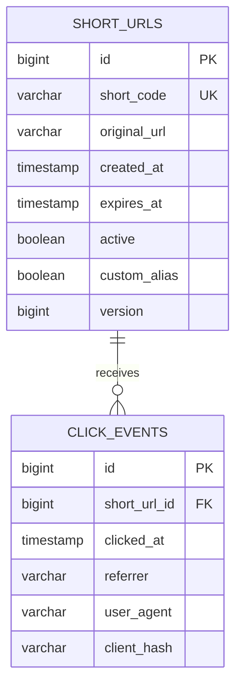
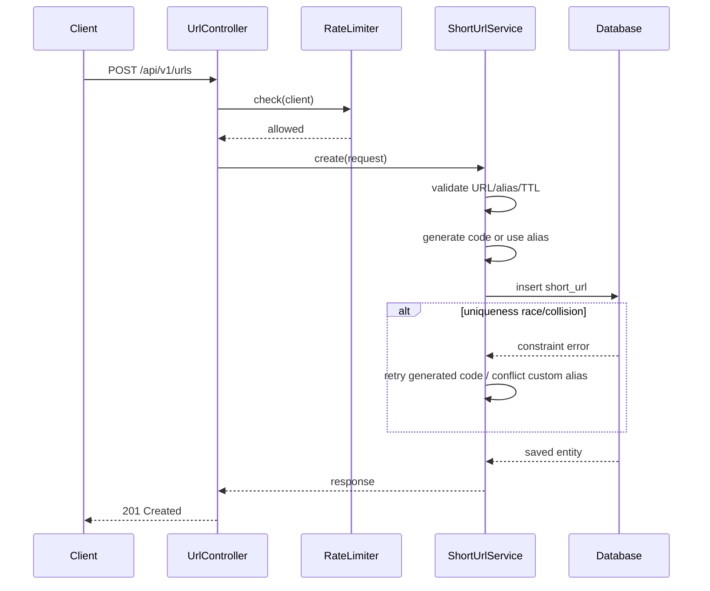
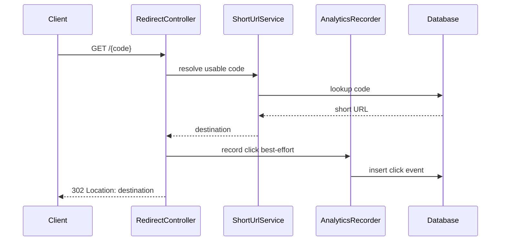

# Architecture Overview

## Goal

Provide a small, reviewable URL-shortening service that is simple to run locally while demonstrating modular design, reliability controls, analytics, validation, and a clear path to production scale.

## Components

### `UrlController`
Owns management APIs: create, metadata, analytics, and deactivate. It contains HTTP concerns only and delegates domain behavior to services.

### `RedirectController`
Resolves a short code and returns `302 Found` with the destination in the `Location` header. Click analytics is recorded as a separate concern.

### `ShortUrlService`
Contains the main domain rules:

- HTTP/HTTPS URL policy
- custom alias policy
- code generation and collision handling
- expiration limits
- active/expired resolution
- metadata mapping
- analytics aggregation

### `AnalyticsRecorder`
Persists one click event per successful redirect. Referrer and user-agent are bounded to database column size. Client address is hashed before persistence.

### `CreateRateLimiter`
Provides lightweight fixed-window creation throttling for the prototype. It is intentionally local to one JVM. In a scaled environment this should move to an API gateway or Redis-backed distributed limiter.

### Repositories
`ShortUrlRepository` and `ClickEventRepository` isolate persistence and use Spring Data JPA.

### H2 database
Chosen for interview portability. The default URL uses file mode so manual demo data survives application restarts.

### Request correlation
`RequestIdFilter` accepts a safe incoming `X-Request-Id` or generates a UUID. The ID is returned in the response and inserted into MDC logging context.

### Actuator
Provides health and metrics endpoints for operational validation.

## Data model

## Create flow

## Redirect flow

## Key design decisions

### Random Base62 codes instead of sequence encoding
Using a database sequence converted to Base62 is simple but predictable. Random codes reduce enumeration risk and avoid exposing rough creation volume. Uniqueness remains enforced by the database.

### Database uniqueness is authoritative
An `exists` check is useful for the common path but cannot prevent races. The unique constraint is the actual concurrency control. Generated-code insertion failures retry; custom aliases return conflict.

### `410 Gone` for expired/deactivated links
An unknown code is `404 Not Found`. A previously valid but now unusable code is `410 Gone`. This makes behavior explicit for clients and tests.

### Analytics separated from redirect domain logic
Redirect correctness should not depend on analytics availability. The prototype keeps the code path separate and documents an asynchronous production evolution.

### H2 only for prototype portability
No Docker database is required for the evaluator. Production storage should use a managed relational database with migrations, backups, replication, monitoring, and capacity planning.

## Production evolution

For higher throughput and multi-instance deployment:

1. PostgreSQL as source of truth.
2. Redis cache for `code -> destination` hot lookups.
3. API gateway or Redis-backed rate limits.
4. Kafka/queue for click events so redirects do not wait on analytics storage.
5. Stream/batch aggregation into analytics tables.
6. Flyway/Liquibase for schema lifecycle.
7. OpenTelemetry tracing and centralized metrics/logging.
8. Deployment behind TLS with appropriate abuse, malware, and destination reputation controls.
